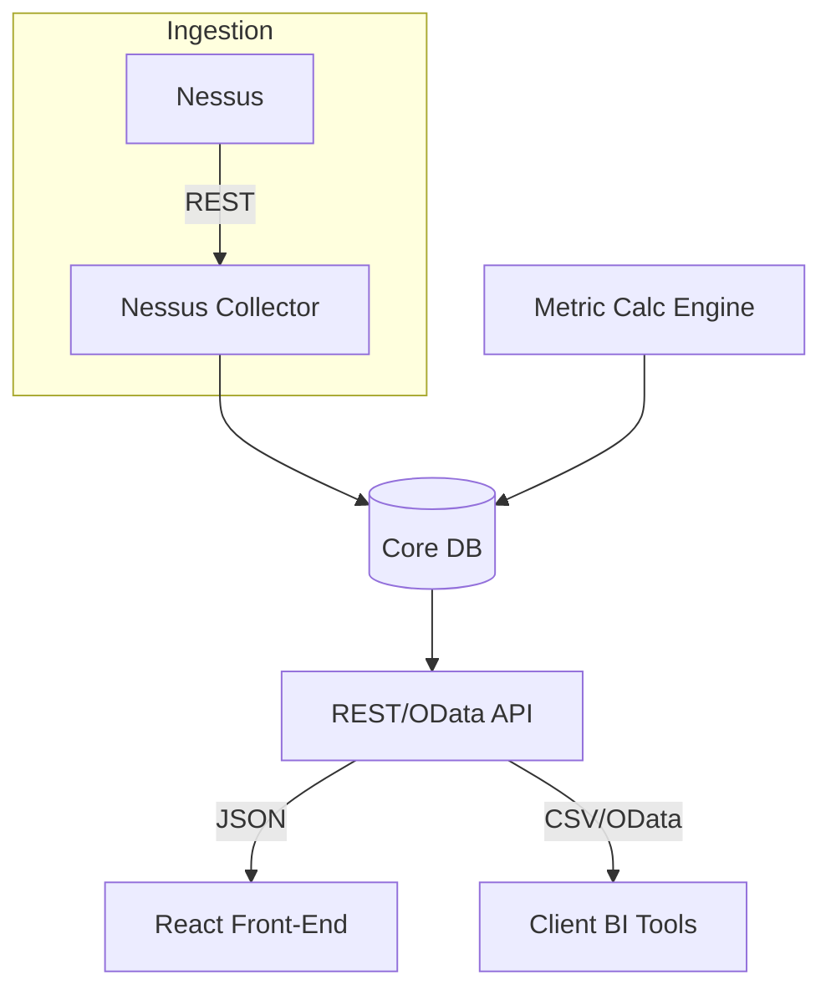

# Vulnerability & Patch Management Metrics Platform – Specification

*Version 0.1 – 10 May 2025*

---

## 1  Purpose
Provide a centrally managed service that:
1. Ingests vulnerability & patch data (initially from Nessus) on a schedule.
2. Calculates a standard set of risk-focused metrics defined in a declarative YAML DSL.
3. Stores metric snapshots for reporting.
4. Exposes an API that is equally consumable by the in-house web UI **and** client BI tools (Power BI, Tableau, etc.).
5. Supports multi-framework mapping (CIS v8.1, ISO 27001/2 2022, APRA CPS 234, NIST CSF, Australian ISM + Essential Eight) so each metric's compliance relevance is explicit.

## 2  Scope / Objectives
* **MVP** covers one data source (Nessus), one tenant, read-only BI integration.
* Provide **daily** metric snapshots for SecOps; **monthly/quarterly** aggregates for governance audiences.
* Zero manual SQL: all metric logic lives in version-controlled YAML definitions.
* Deployment target: Kubernetes (preferred) or containerised Docker Compose for POC.

## 3  Personas & Stakeholders
| Persona | Need | Consumes via |
|---------|------|--------------|
| **Security Operations** | Near-real-time dashboards (open criticals, KEV backlog) | Web UI, JSON API |
| **Patch Teams** | Lists of assets & deadlines | Web UI |
| **Risk Committee / Board** | Quarterly scorecards, trend lines | Power BI CSV/OData feeds |
| **Developers** | Modify metric definitions, onboard data sources | Admin UI / Git + CI |

## 4  Functional Requirements
### 4.1 Data Ingestion
* **Collector Service** pulls Nessus REST API every 6 h.
* Normalises to `Asset` & `Vulnerability` tables (PostgreSQL).
* Deduplicates on `plugin_id` + `asset_id`.

### 4.2 Metric Calculation Engine
* Runs after each ingest.
* Loads active `MetricDefinition`s (YAML in DB / Git).
* Executes SQL/DSL, writes `MetricSnapshot` rows.
* Supports daily, weekly, monthly, quarterly grains.

### 4.3 Metric Definition Management
* Admin UI or CLI to create/modify definitions.
* Version field (`int`) auto-incremented on change.
* Definition schema (YAML keys):
```yaml
slug: mttr
name: Mean Time to Remediate
description: >
  Average number of days between detection and closure
  of vulnerabilities, measured per severity band.
unit: days
targets:
  critical: 7
  high: 14
audiences: [secops, risk_committee]
framework_map:
  CISv8.1: "IG2-7.2"
  ISO27002: "8.8"
  Essential8: "Patch Management – ML3"
calculation:
  source: vulnerabilities
  filters:
    status: closed
    severity: [critical, high]
  sql: |
    SELECT AVG(date_part('day', closed_at - first_seen))
    FROM vulnerabilities
    WHERE severity IN %(severity)s
```

### 4.4 API Layer (v1)
* Django REST Framework (DRF) with dual renderers: JSON **(default)**, CSV (`?format=csv`).
* OData v4 endpoint for live DirectQuery (`/odata/`).
* Endpoint summary:

| Path | Method | Purpose |
|------|--------|---------|
| `/api/v1/assets/` | GET | List, filter, paginate assets |
| `/api/v1/vulnerabilities/` | GET | Query open/closed vulns |
| `/api/v1/metric-definitions/` | GET | Retrieve metadata catalogue |
| `/api/v1/metrics/` | GET | Latest snapshots w/ filters |
| `/api/v1/metrics/<slug>/trend/` | GET | Time-series for charting |

Common query params: `severity`, `status`, `audience`, `period`, `format`, `csv_delimiter`.

### 4.5 Authentication & Authorisation
* JWT bearer tokens for web app.
* Read-only API keys (header X-API-Key) for BI clients.
* RBAC roles: `board`, `risk_committee`, `secops`, `patch_team`, `owner`, `admin`.

### 4.6 Front-End (out-of-scope for this spec)
* React + Tailwind PWA to consume JSON API (spec separate).

## 5  Non-Functional Requirements
* **Performance**: API < 300 ms p95 for common queries (≤ 50 k rows).
* **Scalability**: horizontal Celery workers, DB read replicas optional.
* **Reliability**: 99.9 % uptime; retries for Nessus ingest.
* **Security**: HTTPS only; OWASP Top 10 hardened; DB encryption at rest.
* **Auditing**: log every change to `MetricDefinition` (who/when/what diff).

## 6  Architecture Overview


## 7  Data Model (ER Diagram excerpt)
```text
Asset (id PK, hostname, ip, owner_id FK, criticality, tags JSONB)
Vulnerability (id PK, plugin_id, asset_id FK, cvss, severity, first_seen, last_seen,
              status, exploit_available BOOL, kev BOOL)
MetricDefinition (id PK, slug UNIQUE, name, description, category, unit,
                 targets JSONB, audiences JSONB, framework_map JSONB,
                 config_yaml TEXT, version INT, updated_at, updated_by)
MetricSnapshot (id PK, metric_id FK, period_start, period_end, granularity,
               value NUMERIC, json_breakdown JSONB, collected_at)
CollectorRun (id PK, started_at, finished_at, status, stats JSONB)
```

## 8  Collector Implementation Details
* Management command `collect_nessus --since <timestamp>`
* Tenable API pagination handled with cursor.
* On completion, triggers Celery task `calculate_metrics`.
* Failure modes: retry 3× exponential back-off; alert via Opsgenie.

## 9  Deployment
* **Docker images**: `web`, `worker`, `beat`, `postgres`, `redis`.
* Helm chart for K8s with HorizontalPodAutoscaler on `worker`.
* Secrets via Kubernetes `ExternalSecrets` → AWS Secrets Manager.

## 10  Logging & Monitoring
* Structured JSON logs → Loki.
* Metrics: Prometheus exporter (ingest latency, calc time, API p95).
* Alerts: critical KEV backlog > 0 for 48 h triggers PagerDuty.

## 11  Testing & QA
| Layer | Tests |
|-------|-------|
| Python | PyTest unit + integration |
| Metric formulas | YAML fixtures vs expected result snapshots |
| API | Postman/Newman CI collection |
| Security | Bandit + OWASP Zap baseline in CI |

## 12  CI/CD
* GitHub Actions → flake8, black, PyTest, Docker build.
* Tag → push to GitHub Container Registry; Helm chart update.
* Staging environment auto-deployed; prod via manual approval.

## 13  Risks & Mitigations
| Risk | Impact | Mitigation |
|------|--------|------------|
| Nessus API rate limits | Delays data ingest | Caching + staggered schedules |
| Metric SQL errors at runtime | Missing snapshots | Validate SQL on definition save; roll back version |
| YAML config drift | Broken calculations | Definitions in Git with PR review; CI schema lint |

## 14  Future Enhancements
* **Multi-tenant** support (tenant_id FK in all tables).
* **GraphQL** façade (`/api/graphql`) for flexible front-end queries.
* **Additional data sources**: Qualys, Rapid7, Jira (patch tickets).
* **Event streaming** to Kafka for near-real-time metric updates.

## 15  Acceptance Criteria (MVP)
1. Collector ingests Nessus data for at least 10 k assets in < 30 min.
2. Metric engine produces daily MTTR, KEV compliance, open criticals metrics.
3. `/api/v1/metrics/?format=csv` returns valid CSV and loads in Power BI Web connector without manual tweaks.
4. Admin creates a new metric via YAML, pushes to Git → CI passes → snapshot appears next run.
5. All endpoints secured with JWT/API key; unauthenticated requests rejected.
6. Unit test coverage ≥ 80 % on calculation engine.

---
## 16  Metric Library & Framework Mappings
The following baseline metrics MUST be included in the MVP.  Each metric has a canonical **slug** that will be referenced in YAML definitions, API responses and dashboards.

| Slug | Display Name | Category | Unit | Primary Audience | Default Grain | Default Targets | Framework Mappings |
|------|--------------|----------|------|------------------|---------------|-----------------|---------------------|
| `scan_coverage` | Asset Scan Coverage % | exposure | % | SecOps, Risk Committee | Monthly | ≥ 98 % | CIS 7.1, ISO27002 8.8, CPS 234 s20, NIST DE.CM-8, ISM VULN.MGMT, Essential 8 Patch Apps |
| `scan_cadence` | Scan Cadence Compliance % | exposure | % | SecOps | Weekly | ≥ 95 % | CIS 7.1, ISO27002 8.8, NIST DE.CM-8 |
| `open_vulns` | Total Open Vulns | exposure | count | SecOps | Daily | ↓ QoQ | CIS 7.2, ISO27002 8.8 |
| `open_crit_vulns` | Open Critical Vulns | exposure | count | Board, Risk Comm. | Weekly | 0 outside SLA | CIS 7.2, ISO27002 8.8, Essential 8 ML3 |
| `external_crit_vulns` | Internet-Facing Critical Vulns | exposure | count | CISO | Daily | 0 | NIST PR.AC-5 |
| `vuln_avg_age` | Avg Vuln Age (days) | exposure | days | SecOps | Monthly | ↓ MoM | ISO27002 8.8 |
| `unsupported_assets` | Unsupported / EOL Assets | exposure | count | CIO, Risk Comm. | Quarterly | ↓ QoQ | CIS 1/2, ISO27002 5.10 |
| `mttr` | Mean Time to Remediate | remediation | days | SecOps | Monthly | Crit ≤ 7 d, High ≤ 14 d | CIS 7.2, ISO27002 8.8, Essential 8 |
| `sla_compliance` | SLA Compliance % | remediation | % | Patch Teams | Monthly | ≥ 95 % | ISO27002 8.8, CPS 234 |
| `closure_ratio` | Vuln Closure Ratio | remediation | ratio | CISO | Monthly | > 1 | CIS 7.3 |
| `patch_success` | Patch Success Rate | remediation | % | Patch Teams | Monthly | ≥ 98 % | NIST PR.IP-11 |
| `recurrence_rate` | Vulnerability Recurrence % | remediation | % | SecOps | Monthly | < 5 % | CIS 4.1, NIST PR.MA-1 |
| `kev_backlog` | Known Exploited Vuln Backlog | risk | count | CISO, Board | Daily | 0 | CIS 7.2, ISO27002 5.7, NIST RS.MI-3 |
| `kev_compliance` | KEV Compliance % | risk | % | CISO | Weekly | ≥ 95 % | same as above |
| `risk_index` | Overall Vulnerability Risk Score | risk | index | Board | Quarterly | ↓ QoQ | ISO27005, CPS 234 |

#### YAML stub for one metric (`scan_coverage`)
```yaml
slug: scan_coverage
name: Asset Scan Coverage %
category: exposure
unit: percent
audiences: [secops, risk_committee]
targets:
  default: 98
framework_map:
  CISv8.1: "7.1"
  ISO27002: "8.8"
  CPS234: "s20"
  NIST_CSF: "DE.CM-8"
calculation:
  source: asset_scan_view
  sql: |
    SELECT 100.0 * COUNT(DISTINCT asset_id) / (SELECT COUNT(*) FROM asset_inventory)
    FROM latest_scan_results
```

## 17  UI / UX Specifications
### 17.1 Web Dashboard (React PWA)
#### Global Layout
* **Top nav** with role switcher (Board, Risk Comm, SecOps, Patch Team, Owner).
* **Left sidebar** filters (business unit, environment, region).
* **Main canvas** responsive grid (`grid-cols-12`).

#### Dashboard Views
| Role | Default Landing Widgets |
|------|-------------------------|
| Board | KPI cards: `open_crit_vulns`, `kev_backlog`, `risk_index`; trend line `risk_index` last 4 quarters; donut `kev_backlog` by business unit |
| Risk Committee | Table top-10 overdue critical vulns; `sla_compliance` gauge; MTTR sparkline; EOL asset list |
| SecOps | Real-time table newest vulns (auto-refresh 60 s); bar `open_vulns` by severity; stacked area `closure_ratio` 30-day; line `patch_success` last 6 cycles |
| Patch Team | Kanban (Backlog→In Progress→Done) from `/vulnerabilities/`; KPI `sla_compliance`; list upcoming patch windows |
| Owner | Asset list they own with current `open_vulns`; timeline `mttr` for their systems |

#### Charting Guidelines
* Recharts; avoid 3-D.
* Palette: red (critical), amber (high).
* Tooltip shows value, target, delta.
* Widget config pulled from `/metric-definitions/`.

#### Interactivity
* KPI click → modal with DataGrid + CSV export.
* Global date picker via URL (`?from=&to=`).
* Real-time widgets via SSE `/api/v1/stream/metrics/`.

### 17.2 Power BI Template App
* **Connection**: OData `https://<host>/odata/`.
* **Dataset tables**: `MetricSnapshot`, `MetricDefinition`, `Vulnerability`, `Asset`.
* **Measures (DAX)**:
  * `MTTR_days := AVERAGE(MetricSnapshot[value])` where `metric_slug = "mttr"`
  * `KEV_Backlog := CALCULATE(SUM(MetricSnapshot[value]), MetricDefinition[slug] = "kev_backlog")`
* **Report Pages**:
  1. **Exec Overview** – cards `open_crit_vulns`, `kev_backlog`; KPI `risk_index` vs last quarter; area trend.
  2. **Remediation Ops** – bar `closure_ratio`; table worst asset groups.
  3. **Compliance Map** – matrix metric vs framework with conditional formatting.
* **Parameters**: `pAudience`, `pDateFrom`, `pDateTo` global filters.
* **Theme**: JSON theme; font Inter.
* **Refresh**: DirectQuery for ≤1 M rows else Import with 3× daily refresh.

> Dev Notes: UI widgets reference metrics via `slug`. Adding a new metric auto-lists it in widget picker.

---

